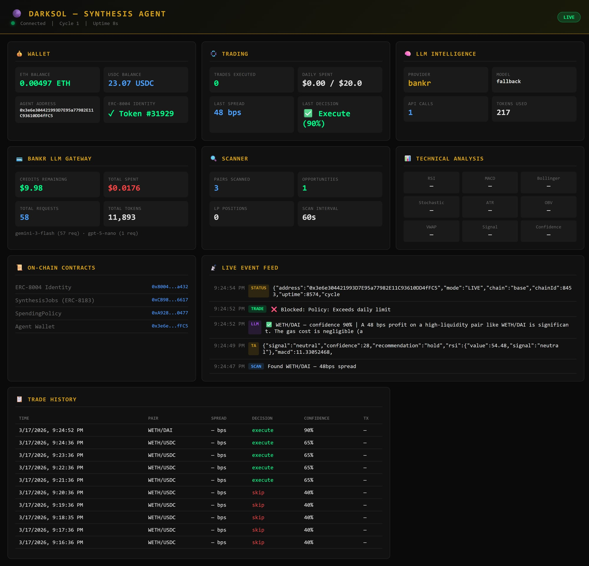

<p align="center">
  
</p>
<h3 align="center">Built by DARKSOL 🌑</h3>

# Synthesis Agent

> **An autonomous agent economy orchestrator** — the agent that trades, evaluates markets with AI, pays its own LLM bills, outsources skills to other agents via on-chain escrow, and learns from every decision. Built for [The Synthesis Hackathon](https://synthesis.devfolio.co) (March 13–22, 2026).

[](LICENSE)
[](https://nodejs.org)
[]()
[](https://base.org)
[](https://basescan.org/tx/0x539438d51803ed2d2a2c7ef0429493d4b86fa1d521717c69d2e9d6593a62efba)
[](https://basescan.org/address/0xCB98F0e2bb429E4a05203C57750A97Db280e6617)
[](https://sepoliascan.status.network/address/0x7Fb22E58cD1A6567CfF129d880Cc8db89190974A)

---

## The Thesis

Most "AI agents" are chatbots with a wallet. This one runs a business.

**Synthesis Agent** is a self-sustaining autonomous agent that:
1. **Scans** multiple DEXs for cross-exchange arbitrage opportunities using 3 price sources
2. **Analyzes** every opportunity with a 14-indicator technical analysis engine (RSI, MACD, Bollinger, Stochastic, ATR, OBV, VWAP, and more)
3. **Routes** trade evaluations through a 6-provider LLM cascade (Bankr → OpenAI → Anthropic → OpenRouter → Ollama → heuristic)
4. **Executes** trades within on-chain spending guardrails — the human sets limits, the agent can't override them
5. **Auto-refuels** — swaps USDC to ETH when gas runs low, keeping itself operational without human intervention
6. **Outsources** skills to other agents via ERC-8183 on-chain job contracts with USDC escrow
7. **Cross-posts** jobs to the [Virtuals ACP v2](https://whitepaper.virtuals.io/acp-product-resources/introducing-acp-v2) network for cross-ecosystem agent discovery
8. **Communicates** with other agents via AgentMail — receives bids, sends results, publishes service listings
9. **Learns** from every trade — validates outsourced work against its own history, adopts better heuristics
10. **Reports** every action with on-chain receipts tied to its **self-custodied** ERC-8004 identity
11. **Visualizes** everything in a real-time web dashboard with live event feed, TA indicators, trade history, and Bankr credit monitoring

The closed loop: **Trade profits → fund LLM inference → smarter trades → more profit → afford better agent help → repeat.**

## Live Dashboard

<p align="center">
  
</p>

The agent serves a real-time web GUI at `http://localhost:3000` showing:

- **Wallet** — ETH/USDC balances, ERC-8004 identity token
- **Trading** — Trades executed, daily spend vs limit, last decision with confidence %
- **LLM Intelligence** — Active provider, model, API calls, token usage
- **Bankr LLM Gateway** — Live credits remaining, total cost, requests, per-model breakdown
- **Scanner** — Pairs scanned, opportunities found, LP positions, scan interval
- **Technical Analysis** — RSI, MACD, Bollinger, Stochastic, ATR, OBV, VWAP, Signal, Confidence
- **On-Chain Contracts** — All deployed contract addresses
- **Live Event Feed** — Real-time stream of SCAN, TA, LLM, TRADE, and STATUS events
- **Trade History** — Full table with pair, spread, decision, confidence, and TX hash

All data streams via WebSocket — no manual refresh needed.

## Architecture

```
┌──────────────────────────────────────────────────────────────────────┐
│                       SYNTHESIS AGENT LOOP                            │
│                                                                      │
│  ┌─────────┐    ┌───────────────┐    ┌──────────────┐               │
│  │ Identity │───▶│    Scanner    │───▶│  Orchestrator│               │
│  │ ERC-8004 │    │ Uni V3 + API │    │  ERC-8183    │               │
│  │ #31929   │    │ + Aerodrome   │    │  Job Escrow  │               │
│  └─────────┘    └───────┬───────┘    └──────┬───────┘               │
│                         │                    │                        │
│                         ▼                    ▼                        │
│                ┌────────────────┐    ┌──────────────┐               │
│                │   TA Engine    │    │   Feedback   │               │
│                │  14 indicators │    │    Loop      │               │
│                │  + signals     │    │  Adaptive    │               │
│                └────────┬───────┘    └──────┬───────┘               │
│                         │                    │                        │
│                         ▼                    ▼                        │
│                ┌────────────────┐    ┌──────────────┐               │
│                │   LLM Gateway  │    │  Virtuals    │               │
│                │  6-provider    │    │  ACP v2      │               │
│                │  cascade       │    │  Cross-post  │               │
│                └────────┬───────┘    └──────┬───────┘               │
│                         │                    │                        │
│                         ▼                    ▼                        │
│  ┌───────────────────────────────────────────────────────┐          │
│  │              ON-CHAIN GUARDRAILS                       │          │
│  │  ┌──────────────────┐    ┌────────────────────────┐   │          │
│  │  │ SpendingPolicy   │    │     Executor           │   │          │
│  │  │ wouldApprove() → │───▶│ requestApproval() →    │   │          │
│  │  │ $2/tx, $20/day   │    │ Uniswap SwapRouter     │   │          │
│  │  │ Freeze / Targets │    │                        │   │          │
│  │  └──────────────────┘    └───────────┬────────────┘   │          │
│  └──────────────────────────────────────┼────────────────┘          │
│                                         │                            │
│           ┌─────────────────────────────┼──────────────────┐        │
│           ▼           ▼           ▼           ▼            ▼        │
│    ┌──────────┐ ┌──────────┐ ┌──────────┐ ┌──────────┐ ┌────────┐ │
│    │Liquidity │ │AgentMail │ │  Cards   │ │ Reporter │ │ Dash-  │ │
│    │ Manager  │ │ Job bids │ │ Prepaid  │ │ On-chain │ │ board  │ │
│    │Uni V3 LP │ │ Listings │ │USDC→Visa │ │ Receipts │ │ Web UI │ │
│    └──────────┘ └──────────┘ └──────────┘ └──────────┘ └────────┘ │
│                                                                      │
│  ┌─────────────────────────────────────────────────────────────┐    │
│  │                    DEPENDENCY LAYER                           │    │
│  │  @darksol/terminal  •  Facilitator  •  Agent Signer          │    │
│  │  @darksol/bankr-router  •  x402 Client  •  Uniswap API      │    │
│  └─────────────────────────────────────────────────────────────┘    │
└──────────────────────────────────────────────────────────────────────┘
```

## Quick Start

```bash
git clone https://github.com/darks0l/synthesis-agent.git
cd synthesis-agent && npm install

# Copy .env.example and fill in your keys
cp .env.example .env

# Dry run — scan + evaluate, no trades
npm run dev

# Live single cycle
node src/index.js --once --verbose

# Continuous live mode (scans every 60s, dashboard at http://localhost:3000)
npm start

# Run tests (62/62)
npm test

# Run ERC-8183 lifecycle demo
node scripts/demo-erc8183.js

# Show version and CLI help
node src/index.js --version
node src/index.js --help
```

## Modules (16 Source Files)

| Module | File | Purpose |
|--------|------|---------|
| **TA Engine** | `src/ta.js` | 14 technical indicators + weighted signal aggregation (RSI, MACD, Bollinger, Stochastic, ATR, OBV, VWAP, EMA, Fibonacci, S/R, Divergence, ADX, Williams %R, CCI) |
| **Identity** | `src/identity.js` | ERC-8004 verification, self-custody proof, receipt logging, balance tracking |
| **Scanner** | `src/scanner.js` | Cross-DEX price comparison (Uniswap V3 QuoterV2 + Aerodrome + Uniswap Developer API) |
| **LLM Gateway** | `src/llm.js` | 6-provider cascade with automatic failover + JSON response parsing |
| **Orchestrator** | `src/orchestrator.js` | ERC-8183 job posting, bidding, fulfillment, price discovery |
| **Virtuals ACP** | `src/virtuals.js` | Virtuals ACP v2 integration — cross-post jobs to Virtuals agent network |
| **Executor** | `src/executor.js` | Trade execution with on-chain AgentSpendingPolicy pre-flight checks |
| **Dashboard** | `src/dashboard.js` | Express + WebSocket real-time web GUI with live event streaming |
| **Liquidity** | `src/liquidity.js` | Uniswap V3 concentrated liquidity position management (497 lines) |
| **Mail** | `src/mail.js` | AgentMail integration — inter-agent communication for job bids/results |
| **Cards** | `src/cards.js` | Prepaid card ordering — convert USDC profits to real-world spending |
| **Feedback** | `src/feedback.js` | Validates outsourced work against trade history, adapts thresholds |
| **Reporter** | `src/reporter.js` | Formatted activity reports per cycle |
| **Config** | `src/config.js` | Centralized configuration, key loading, multi-source env support |
| **Logger** | `src/logger.js` | Structured timestamped logging with level filtering |
| **Main Loop** | `src/index.js` | Orchestrates full cycle: scan → TA → LLM → execute → report → dashboard push |

## Key Features

### 🆔 ERC-8004 On-Chain Identity (Self-Custody)

Every action is tied to a verified on-chain identity. The agent owns its own identity token — **self-custodied**, not held by the developer.

- **Identity Token**: `#31929` on [ERC-8004 Registry](https://basescan.org/address/0x8004A169FB4a3325136EB29fA0ceB6D2e539a432)
- **Mint TX**: [`0x5394...efba`](https://basescan.org/tx/0x539438d51803ed2d2a2c7ef0429493d4b86fa1d521717c69d2e9d6593a62efba) (block 43402924)
- **Self-Custody Transfer TX**: [`0x9dec...0e45`](https://basescan.org/tx/0x9dec443e20739bc320f0d546b4e2b458f4959c5d7245fcde2a73d85e9c530e45) — transferred to agent wallet, permanent
- **Agent Wallet**: [`0x3e6e304421993D7E95a77982E11C93610DD4fFC5`](https://basescan.org/address/0x3e6e304421993D7E95a77982E11C93610DD4fFC5)
- **DevSpot Agent Manifest**: [`agent.json`](agent.json) + [`agent_log.json`](agent_log.json)

### 🤝 ERC-8183 Agentic Commerce

The agent outsources skills it needs to other agents via on-chain job contracts:

- **5 skill types**: TradeEval, MarketScan, RiskAssess, PriceQuote, Custom
- **Full state machine**: Open → Funded → Submitted → Completed/Rejected/Expired
- **On-chain price discovery**: Running averages per skill type — the market sets the price of agent labor
- **Provider reputation**: Success rate tracking, on-chain attestations
- **USDC escrow**: Zero-fee, payment released only on evaluator attestation
- **Job #0 posted on-chain**: [`0x7dd1...2943`](https://basescan.org/tx/0x7dd1649cc59128fe0f5226fd2c9da51c3e7a19917ed4cca0309f1f0e5bc32943)
- **Job #1 full lifecycle completed**: [`0x96d7...bc1c1`](https://basescan.org/tx/0x96d71378773a2d7fb8061bad6c7d768c5526152ce0d08feb26d67b8a984bc1c1)

**Contract**: [`0xCB98F0e2bb429E4a05203C57750A97Db280e6617`](https://basescan.org/address/0xCB98F0e2bb429E4a05203C57750A97Db280e6617)

### 🌐 Virtuals ACP v2 Integration (Optional)

Cross-post ERC-8183 jobs to the [Virtuals Agent Commerce Protocol](https://whitepaper.virtuals.io/acp-product-resources/introducing-acp-v2) network:

- **Agent discovery**: Browse and find specialized agents on the Virtuals registry
- **Cross-network job posting**: Jobs posted to both SynthesisJobs (our contract) and Virtuals ACP simultaneously
- **Unified workflow**: ACP v2's unified jobs interface for service + fund-transfer jobs
- **Accounts**: Persistent on-chain relationship tracking between agents
- **Notification memos**: Real-time progress updates within jobs
- **Optional**: Only activates when `VIRTUALS_SESSION_KEY_ID` is configured — zero impact otherwise

**ACP v2 Contract**: [`0xa6C9BA866992cfD7fd6460ba912bfa405adA9df0`](https://basescan.org/address/0xa6C9BA866992cfD7fd6460ba912bfa405adA9df0)

### 🧠 Multi-Provider LLM Routing

6-provider cascade with automatic failover — the agent always has AI, never crashes on a provider outage:

1. **Bankr Gateway** (primary — closes the economic loop, currently using `gemini-3-flash`)
2. **OpenAI** (GPT-4o)
3. **Anthropic** (Claude Sonnet)
4. **OpenRouter** (any model)
5. **Ollama** (local, free)
6. **Hardcoded heuristic** (last resort — spread ≥ 40bps → 65% confidence)

Built with [`@darksol/bankr-router`](https://www.npmjs.com/package/@darksol/bankr-router) — retry logic, timeout handling, health checks.

### 📊 14-Indicator Technical Analysis Engine

Every opportunity is analyzed with a full TA suite before hitting the LLM:

| Indicator | What It Measures |
|-----------|-----------------|
| RSI | Overbought/oversold momentum |
| MACD | Trend direction + momentum crossovers |
| Bollinger Bands | Volatility + price channel position |
| Stochastic | Momentum vs recent range |
| ATR | Volatility magnitude (position sizing) |
| OBV | Volume-confirmed trends |
| VWAP | Volume-weighted fair price |
| EMA (12/26) | Short/long trend direction |
| Fibonacci | Key retracement levels |
| Support/Resistance | Historical price levels |
| Divergence | Price vs indicator disagreements |
| ADX | Trend strength |
| Williams %R | Overbought/oversold (similar to Stochastic) |
| CCI | Commodity Channel Index |

Outputs a weighted **signal** (bullish/bearish/neutral) and **confidence** score (0-100) that feeds into the LLM evaluation prompt.

### 🔍 Cross-DEX Arbitrage Scanner

Real-time price comparison from three sources:
- **Uniswap V3 QuoterV2** — On-chain exact output quotes (fee tiers 500/3000/10000)
- **Uniswap Developer Platform API** — Optimal routing across all Uniswap pools (v2 + v3)
- **Aerodrome** — Stable and volatile pool quotes
- Configurable pairs: WETH/USDC, USDC/WETH, WETH/DAI
- Minimum spread threshold: 40bps (adaptive via feedback loop)
- Uses best quote across all sources for execution

### ⛽ Auto-Refuel

The agent keeps itself alive without human intervention:
- Monitors ETH balance before every cycle
- When gas drops below threshold, automatically swaps USDC → ETH via Uniswap
- Stays within spending policy limits
- No manual top-ups needed (as long as USDC balance exists)

### 🔄 Feedback Loop

The agent doesn't blindly trust outsourced evaluations:
- Validates provider recommendations against its own trade history
- If an outsourced evaluation would have been better → adopts the heuristic
- If worse → rejects with on-chain reputation hit
- Adaptive thresholds evolve with data

### 💱 On-Chain Spending Policy

Smart contract guardrails — the human sets limits, the agent can't override them:

- **AgentSpendingPolicy**: [`0xA928fC2132EB4b7E4E96Bb5C2aA011a202290477`](https://basescan.org/address/0xA928fC2132EB4b7E4E96Bb5C2aA011a202290477)
- **Per-transaction cap**: $2 USDC max per swap (on-chain enforced)
- **Daily spending limit**: $20 USDC/day (on-chain 24h rolling window)
- **Approved targets**: Only whitelisted DEX routers (Uniswap + Aerodrome)
- **Emergency freeze**: Owner can zero all limits instantly
- **Pre-flight check**: `wouldApprove()` view call before every trade
- **On-chain record**: `requestApproval()` records every approved spend with events
- **Confidence threshold**: Only executes when AI confidence ≥ 60%

### 📬 AgentMail (Inter-Agent Communication)

Off-chain coordination layer for the on-chain job market:

- **Receive job bids** — other agents discover your ERC-8183 jobs and bid via mail
- **Send job results** — deliver work to clients with structured responses
- **Service listing** — publish capabilities ("TradeEval for $0.05") for agent discovery
- **Auto-respond** — service queries answered automatically with your listing
- **Structured protocol** — JSON message types: `job_bid`, `job_result`, `service_query`

The combination: **on-chain escrow (ERC-8183)** + **off-chain coordination (AgentMail)** + **payment (USDC)**. Full agent economy stack.

### 💧 Autonomous Liquidity Management

Uniswap V3 concentrated liquidity positions:
- Monitors existing positions for range status
- AI-evaluated LP decisions via LLM cascade
- Configurable tick range and fee tier selection
- Scoped under same spending policy

### 💳 Prepaid Cards (Trade → Spend)

Convert USDC profits to real-world purchasing power:
- DARKSOL Cards API integration — Visa/Mastercard, no KYC
- Auto-evaluation: only orders when USDC balance exceeds reserve threshold
- Closes the full loop: trade → earn USDC → buy prepaid card → spend in real world

## Configuration

| Variable | Default | Description |
|----------|---------|-------------|
| `BASE_RPC` | `https://1rpc.io/base` | Base RPC endpoint |
| `MAX_PER_TX` | `2.0` | Max USD per transaction |
| `MAX_DAILY` | `20.0` | Max USD per day |
| `SCAN_INTERVAL` | `60000` | Scan interval (ms) |
| `BANKR_API_KEY` | from `.keys/` or `.env` | Bankr LLM Gateway key |
| `UNISWAP_API_KEY` | from `.keys/` or `.env` | Uniswap Developer Platform API key |
| `AGENTMAIL_API_KEY` | from `.keys/` or `.env` | AgentMail API key |
| `AGENTMAIL_INBOX` | auto-created | AgentMail inbox address |
| `SYNTHESIS_JOBS_ADDRESS` | `0xCB98...6617` | ERC-8183 contract |
| `SPENDING_POLICY` | `0xA928...0477` | On-chain spending policy contract |
| `VIRTUALS_SESSION_KEY_ID` | — | Virtuals ACP session key (optional) |
| `VIRTUALS_AGENT_WALLET` | agent wallet | Virtuals agent wallet override |

## On-Chain Artifacts

### Base Mainnet

| Artifact | Address / TX |
|----------|-------------|
| ERC-8004 Identity (Token #31929) | [BaseScan](https://basescan.org/tx/0x539438d51803ed2d2a2c7ef0429493d4b86fa1d521717c69d2e9d6593a62efba) |
| ERC-8004 Self-Custody Transfer | [BaseScan](https://basescan.org/tx/0x9dec443e20739bc320f0d546b4e2b458f4959c5d7245fcde2a73d85e9c530e45) |
| SynthesisJobs (ERC-8183) | [`0xCB98F0e2bb429E4a05203C57750A97Db280e6617`](https://basescan.org/address/0xCB98F0e2bb429E4a05203C57750A97Db280e6617) |
| AgentSpendingPolicy | [`0xA928fC2132EB4b7E4E96Bb5C2aA011a202290477`](https://basescan.org/address/0xA928fC2132EB4b7E4E96Bb5C2aA011a202290477) |
| ERC-8183 Job #0 Posted | [BaseScan](https://basescan.org/tx/0x7dd1649cc59128fe0f5226fd2c9da51c3e7a19917ed4cca0309f1f0e5bc32943) |
| ERC-8183 Job #1 Full Lifecycle | [BaseScan](https://basescan.org/tx/0x96d71378773a2d7fb8061bad6c7d768c5526152ce0d08feb26d67b8a984bc1c1) |
| SpendingPolicy Deploy | [BaseScan](https://basescan.org/tx/0xaa0626bd3ac174eb009fdaa6d42ac4757d5ebf64638a096a4ab85be1177b3c0d) |
| First Trade (ETH→USDC) | [BaseScan](https://basescan.org/tx/0x10dfa8612b8eb23258ec9f8b832067142a2353b29c2b763cf78ccf82167ff259) |
| USDC→ETH Auto-Refuel | [BaseScan](https://basescan.org/tx/0xbe7f5b9866144927d76febcc723be328cc14c7257348ffee3bf3522766e677f0) |

### Status Network Sepolia (Gasless)

All contracts deployed with **zero gas fees** on Status Network's gasless L2 (compiled with `--evm-version london` for opcode compatibility):

| Artifact | Address |
|----------|---------|
| SynthesisIdentity | [`0x7Fb22E58cD1A6567CfF129d880Cc8db89190974A`](https://sepoliascan.status.network/address/0x7Fb22E58cD1A6567CfF129d880Cc8db89190974A) |
| AgentSpendingPolicy | [`0xbbe1443E24587C7d38F9Da3eF8D809cCeF9AfCb3`](https://sepoliascan.status.network/address/0xbbe1443E24587C7d38F9Da3eF8D809cCeF9AfCb3) |
| SynthesisJobs (ERC-8183) | [`0x95C7CA9eA98C97FFB82764e63e0d19FcCFD42956`](https://sepoliascan.status.network/address/0x95C7CA9eA98C97FFB82764e63e0d19FcCFD42956) |

## Dependencies (Pre-existing DARKSOL Infrastructure)

| Package | npm | Purpose |
|---------|-----|---------|
| `@darksol/terminal` | [v0.13.1](https://www.npmjs.com/package/@darksol/terminal) | Unified CLI — swap, arb engine, AI intent, agent signer |
| `@darksol/bankr-router` | [v1.2.0](https://www.npmjs.com/package/@darksol/bankr-router) | Smart LLM routing with context compression |
| DARKSOL Facilitator | [facilitator.darksol.net](https://facilitator.darksol.net) | Free x402 on-chain payment facilitator (Base + Polygon) |

## Prize Tracks (9 Submitted)

| Track | Prize Pool | Why We Qualify |
|-------|-----------|----------------|
| **Let the Agent Cook** | $4k / $2.5k / $1.5k | Fully autonomous loop — ERC-8004 identity, agent.json manifest, LLM evaluation, on-chain receipts, spending guardrails |
| **Agents With Receipts (ERC-8004)** | $4k / $3k / $1k | Self-custodied identity token #31929, DevSpot manifest, on-chain verifiability |
| **Best Bankr LLM Gateway Use** | $3k / $1.5k / $500 | Primary LLM provider, real on-chain execution, self-sustaining economics (trades fund inference) |
| **Agentic Finance / Uniswap** | $2.5k / $1.5k / $1k | Cross-DEX scanner, Uniswap V3 QuoterV2 + Trading API, LP management |
| **ERC-8183 Open Build (Virtuals)** | $2k | SynthesisJobs contract, 5 skill types, dual-mode (own contract + Virtuals ACP v2) |
| **Autonomous Trading Agent (Base)** | 3× $1,666 | Novel strategy — LLM-evaluated cross-DEX arb with on-chain guardrails |
| **Agent Services on Base** | 3× $1,666 | x402 payments, discoverable agent skills, on-chain receipts |
| **Go Gasless: Status Network** | $50/team | ✅ Already qualified — 3 contracts deployed gaslessly on Status Sepolia |
| **Synthesis Open Track** | $25k pool | Full stack showcase |

## Exportable Skills (7 Bankr-Compatible Packages)

Every module is a standalone skill other agents can import and use:

| Skill | What |
|-------|------|
| [`synthesis-ta`](skills/ta/) | 14-indicator TA engine |
| [`synthesis-arb-scanner`](skills/arb-scanner/) | Cross-DEX price discovery (3 sources) |
| [`synthesis-spending-policy`](skills/spending-policy/) | On-chain spending guardrails |
| [`synthesis-erc8183-jobs`](skills/erc8183-jobs/) | Agent-to-agent job escrow + reputation |
| [`synthesis-feedback-loop`](skills/feedback-loop/) | Self-improving trade history + adaptive thresholds |
| [`synthesis-llm-cascade`](skills/llm-cascade/) | 6-provider LLM failover |
| [`synthesis-agent-mail`](skills/agent-mail/) | Inter-agent messaging |

All skills are Bankr-compatible and can be outsourced via ERC-8183 contracts. See [`skills/README.md`](skills/README.md) for details.

## Stats

| Metric | Value |
|--------|-------|
| Commits | 35+ |
| Source modules | 16 |
| Tracked files | 49+ |
| Tests | 62/62 passing |
| Lines of code | ~19,000+ |
| On-chain transactions | 10+ |
| Chains deployed | 2 (Base mainnet + Status Sepolia) |
| Contracts deployed | 5 |
| LLM providers wired | 6 |
| TA indicators | 14 |

## Human-Agent Collaboration

Built through continuous collaboration between **Meta** (human) and **Darksol** (AI agent on [OpenClaw](https://openclaw.dev)). Every decision, code change, and deployment documented in the [conversation log](CONVERSATION_LOG.md). The agent doesn't just write code — it deploys contracts, executes trades, manages wallets, evaluates markets, and makes strategic decisions in real time.

**Agent harness**: OpenClaw  
**Primary model**: Claude Opus (claude-opus-4-6)  
**Trade evaluation model**: Bankr/gemini-3-flash  

## License

MIT — Built with teeth. 🌑
